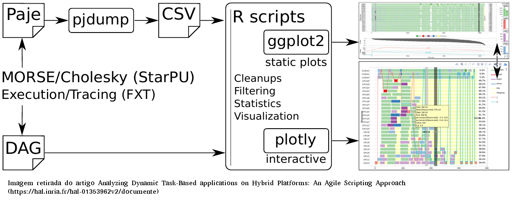
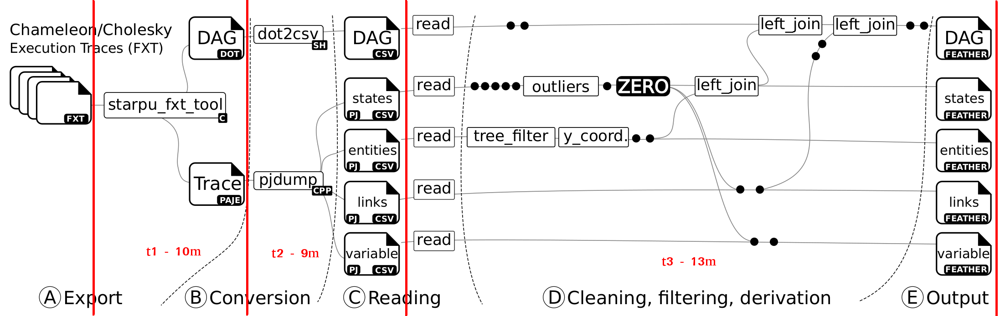

## Texto - Padronização
- Termos em inglês - textit | emph
- Tipos de arquivo - textit | emph
- Referências a coisas em Figuras - textit | emph
- Nomes de bibliotecas - texttt
- Linguagem de programação - sem formatação
- Spark - sem formatação
- Funções e códigos - texttt


## Glossário de termos da área
| Termo  | Descrição  |
|:--|:--|
| BSP applications | Bulk-synchronous parallel applications, abordagem comum quando trabalhando com ambientes homogêneos.  |
| DAG applications | Aplicações Task-based modeladas em um Directed Acyclic Graph. |
| Exascale computing | Computação no nível de exaFLOPS. |
### Notas sobre Analyzing Dynamic Task-Based applications on Hybrid Platforms: An Agile Scripting Approach
- Análise de aplicações _task-based_ em arquiteturas híbridas
- StarPU runtime system -> task parallelism runtime que objetiva explorar arqui
teturas híbridas, fornecendo uma extensão _MPI-based_ para explorar vários nós.
- Identificação de erros de alocação, problemas de prioridade em decisões de alo
cação, anomalias em tarefas de GPU e questões envolvendo caminho crítico.

- Devido a demanda de mais poder de processamento, é comum utilizar _nodes_
híbridos, compostos por processadores multicore, com múltiplas GPUs.
- Por causa da heterogeneidade e complexidade dessas máquinas, é comum surgirem
problemas de performance.
- Desenvolvido Framework para facilitar identificação de problemas de performan
ce, combinando R (ggplot2) e org-mode
- Há diversos _runtimes_ para executar aplicações _task-based_ (é importante enu
    merar alguns para a contextualização na proposta)
- BSP-based trace visualization tools - exemplos?
    - Vite
    - Paraver
    - Vampir - proprietary
- MPI é BSP-based, a maior parte das ferramentas de visualização focam nela.
- Técnicas comum é baseada em gráficos Gantt.
- Visualização para aplicações DAG
    - Construidas com recursos não projetados para análise de dados.
    - Baseiam-se ou em estratégias ou não escaláveis ou não baseadas em scripts
    (ex: com interações com mouse).
    - DAGViz
        - Representação visual de tarefas, focada na estrutura DAG, representan
        do de forma hierárquica
        - Obtida com a utilização de Macros (traduzido para Cilk, Intel TBB ou
            OpenMP)
        - Não há como obter dimensão de tempo e duração de tarefas, o que torna
        a análise de performance difícil.
    - Temanejo
        - Similar ao DAGViz (timeless DAG interativo)
        - Funcionalidade de debug
    - Haugen
        - Gannt com dependências
        - Não é escalável
        - Mostra apenas um nível de dependências (pode ser necessário diversos)
        níveis para entender o problema de escalonamento.
- Comportamento estocástico dificulta reproducibilidade
- Dependências entre tarefas são parte da aplicação e devem ser exploradas para
entender gargalos
- Traces desse domínio de aplicação são grandes, é necessário filtrar apenas da
dos relevantes
- É difícil de desenvolver algo _general purpose_ para cobrir todos os casos de
análise, motivação para fazer algo baseado em scripts
- Uma abordagem comum é avaliar traces de uma mesma aplicação rodando com dife
rentes escalonadores. Para analisar essas múltiplas execuções, é necessário sin
cronizar e filtrar os traces.
- Framework de visualização proposto, permite combinar de forma fácil e rápida
várias visualizações e propor visualizações alternativas de forma ágil.
- Workflow retirado do artigo (https://hal.inria.fr/hal-01353962v2/document)

    1. StarPU converte traces FXT para reproduzir eventos com registro de data
    e hora na linguagem Paje.
    2. Também é criado um DAG com identificadores coerentes com o trace Paje.
    3. Utilizando pjdump, transforma-se os traces Paje em CSV que podem ser car
    regados em R.
    4. Para visualizações estáticas, utiliza-se ggplot2, para dinâmicas, utiliza
    -se plotly

### Notas sobre A Visual Performance Analysis Framework for Task-based Parallel Applications running on Hybrid Clusters
- Fala sobre a Heterogeneidade de arquiteturas atuais de HPC
- Ferramentas para desenvolver e analizar aplicações nessas plataformas torna
ram-se obsoletas, por suas limitações
- Principal responsável por melhorias de performance agora não é quem desenvolve
a aplicação, mas quem desenvolve o runtime (task-based apps)
- Modelo possui duas fases:
    - 1ª realizada em um data server (essa é a que deve ser otimizada)
    - 2ª no PC do analista (leve, apenas para visualização)
- Aplicações HPC antes eram desenvolvidas seguindo paradigma BSP. Tal paradigma
partia do pressuposto um ambiente homogêneo.
- BSP tornou-se impraticável com HW heterogêneo (talvez só ineficiente).
- StarPU é uma plataforma para desenvolvimento de aplicações DAG, focada em ar
quiteturas híbridas (single node).
    - Baseia-se em múltiplas implementações da mesma tarefa, uma para cada recur
    so
- StarPU-MPI - extensão que permite múltiplos nós
- Com a escasses de ferramentas para a análise de performance focadas em task-ba
sed applications, desenvolvedores acabam utilizando aquelas focadas em BSP.
    - Tais ferramentas assumem homogeneidade de recursos
    - Não são adequadas para análise de desenpenho pois heterogeneidade e execu
    ção não estruturada é o comportamento comum em task-based apps.
- Visualização BSP
    - Plots de espaço/tempo, geralmente baseados em Ganntt
    - Vertical -> Recursos | Horizontal -> Tarefas
    - Problema de escala (milhares de cores)
    - Opções
        - Vite
        - Paraver
        - Vampir (Closed-source)
        - Scalasca?
- Aplicações paralelas baseadas em DAG
    - Tem diferentes necessidades durante análise de performance (escalonamento
        estocástico)
    - Poucas ferramentas focadas nesse tipo de aplicação
    - Essas poucas ferramentas se inspiram em ferramentas de visualização de tra
    ces baseadas em BSP
    - Alternativa a visualização no estilo Gantt é o DAGViz
        - Representação visual do DAG e onde as tarefas foram executadas
        - Interativo, permite colapsar, expandir o DAG
        - Não há como obter duração de tarefas, o que torna análise de performan
        ce difícil
    - Temanejo fornece recursos diferentes
- Análise de performance em aplicações Task-Based, tratando-se de ferramentas, é
 imatura.
- Desenvolvedores de aplicações e runtime precisam de soluções efetivas para iden
tificar questões relacionadas a performance.
- Há duas principais dificuldades
    - Integrar várias fontes de dados heterogêneos em um único modelo
    - Adaptar representações gráficas para um objeto tão complexo
- Análises de performance aprofundadas requerem o merge de traces de aplicação,
runtime e hardware.
- No trabalho, considerou-se
    - Uniformidade - Duração de tarefas depende somente de seu tipo e do recurso
    no qual ela será executada.
    - Problemas de dependência - Número de dependências é esperado ser muito
    grande. Por isso, se uma visualização de dependências detalhada mostrar-se
    necessária, a seleção dessas tarefas deve ser realizada via script.
    - Progresso - Execução pode ser em largura, similar a uma Breadth-first search, ou em profundidade, favorecendo o caminho crítico.
    - Melhorias em potencial - É possível basear-se em limites de escalonamento
    clássicos para detectar se melhorias são possíveis (ABE).
    - Agregação e filtragem - Mostrar informações de centenas de milhares de ta
    refas pode não ser eficiente. a ideia é filtrar e agregar informações para
    exibir uma visualização mais eficiente.
    - Distribuição de dados em múltiplos nós - Em um cenário ideal, a carga de
    trabalho é dividida igualmente entre os MPI nodes. Se esse não for o caso,
    perdas de performance podem ser explicadas pelo limite de comunicação no fi
    nal da execução.
- Desta lista de considerações, o trabalho de visualização foi proposto
- Ao realizar o trace do comportamento de aplicação, traces podem se tornar ex
tremamente grandes.
- Algum tipo de redução de dados deve ser aplicada
    - Algumas técnicas reduzem a complexidade apenas em tempo
    - Outras reduzem em tempo e espaço
- No StarVZ, foram utilizados dois métodos de agregação temporal
    - No primeiro, para gráficos de espaço/tempo, o objetivo é seletivamente agregar apenas tipos de tarefas
    que são numerosos
    - No segundo, para gráficos em linha, onde o objetivo foi reduzir o excesso
    de detalhes
- Gráficos de espaço/tempo - integração temporal
    - Tarefas que são raras (ex: tarefas dpotrf na aplicação de estudo) não são
    agregadas
    - Tarefas que são Outliers (demoram mais que o tempo esperado) também não
    são agrupadas
    - Tarefas que não seguem os pontos anteriores (numerosas e executaram no tem
    po esperado) são agrupadas
    - Altura do agrupamento descreve o quanto tempo aquele tipo de tarefa que foi agrupada efetivamente esteve em ação.
- Gráficos em linha - smoothing e reduzindo a complexidade de variáveis
    - Dois problemas que geram a necessidade de realizar-se esses ajustes:
        - Número de pixels não é o suficiente para representar os _data points_
        - Muitas métricas obtidas pelo StarPU, especialmente aquelas
        relacionadas a GPU e MPI, são de fato estimativas.
    - Integração temporal, discretizando o tempo e reduzindo o número de _data
     points_
     - Fazendo integração temporal pode-se esconder certos comportamentos, além
     de criar fases artificiais.
- Workflow

    - Este primeiro workflow será o otimizado a princípio.
    - Não vou entrar no mérito do segundo em anotações.
    - Enviado e-mail para professor, pois conforme Figura, apenas t3 (D - Clea
    ning, filtering, derivation) são realizadas em R. Simplesmente utilizar
    sparklyr nisso é suficiente para TC? Acho que não (embora esse possa ser o
    link do trabalho com a espec.)

# Setup de Máquina
- Debian Stretch tem um pacote do R v3.3.3 pra download via apt-get.
- Seguindo esse tutorial (Debian stretch (stable)), instalei o R v3.6.0
- Finalizado a instalação do R, instalou-se os seguintes pacotes R:
    - tidyverse
    - devtools
    - starVZ package
- Primeira execução do exemplo retornou o erro ERROR: pj_dump is not installed, please install PajeNG or configure PATH

# Slurm
- squeue
    - information about scheduled jobs
    - squeue -p <resource>
- salloc
    - salloc -p draco -J NOME-JOB-EX1 -t 05:00:00
    - salloc -p draco -J SPARK-STARVZ-TEST -t 02:00:00 -N 1 --reboot

# Node Status
    - Beagle1
        - Env ok to run sequential
        - Must set env to run distributed
    - draco1
        - Env ok to run sequential
    - draco4
        - must install Arrow R-package (```remotes::install_github("apache/arrow", subdir = "r", ref = "apache-arrow-0.14.0```)

# Notas


## State
- Em manipulações que tratavam uma coluna como parâmetro (e.g. outlier_fun),
foi necessário expandir pois o sparklyr não consegue tratar esse tipo de manipulação

- Funções de tabelas geralmente possuem sua análoga para tabelas sparklyr
- Manipulações
    - .${Column} <> select({Column})
    - distinct <> unique
    - sort <> sdf_sort
    - separate <> ft_regex_tokenizer + sdf_separate_column
    - gsub <> regexp_replace
    - rbind <> union_all
    - grepl -> rlike

## variables
    - Uso de separate <> ft_regex_tokenizer + sdf_separate_column

## Links
    - Praticamente igual

## Gaps
    - Poucas modificações, uso da equivalência de separate pelo par ft_regex_tokenizer + sdf_separate_column

## Entities
    - Sequencial

## Events
    - Nenhuma manipulação que valha a pena comentar

## Gaps
    - Recursiva
    - Necessário tratar joins com sufixo novo (_ como separador)
    - . é utilizado internamente pelo spark, portanto, havia problemas (sparklyr retornava esse caractere como separador).
    - Todavia, como na execução sequencial é escrito com '.' como separador, executou-se um rename no final do cálculo de GAPS.
