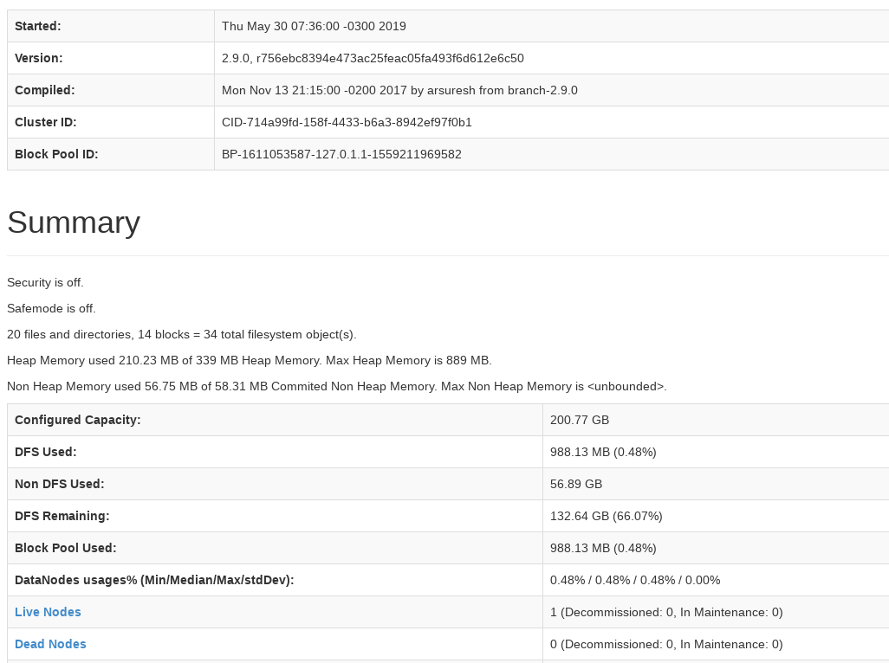
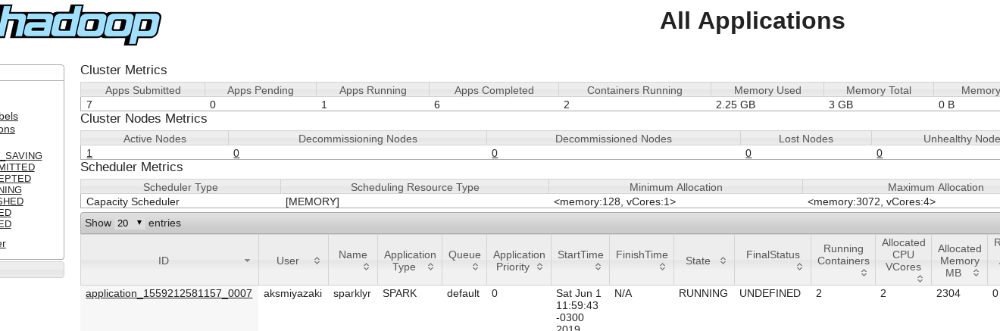

# Anotações sobre o setup de ambiente de desenvolvimento

## Setando Hadoop
- sudo apt-get update; sudo apt-get install git -y; git clone https://github.com/spack/spack.git; source ./spack/share/spack/setup-env.sh;
- Adicionar a linha export PATH=$PATH:$HOME/Spack/bin/ no ~/.bashrc
- source ~/.bashrc
- spack install -y hadoop@2.9.0;
- [SE DISTRIBUÍDO] Adicionado no início do arquivo /etc/hosts:  
    `172.31.13.5	node-master`  
    `172.31.10.137	node-slave1`  
    `172.31.12.249	node-slave2`
- É necessário ter acesso ssh sem senha em todas as máquinas. Se for setup local, é possível ter que instalar um servidor ssh (openssh-server).
    - Se distribuído:
        - Copiadas chaves ssh para ~/.ssh (essas chaves foram criadas especificamente para deploy, não são minhas chaves pessoais)
        - wget https://www.dropbox.com/s/l0g5vx5tn3vueg2/kp_amazon_internal.tar.gz?dl=1; mv kp_amazon_internal.tar.gz\?dl\=1 kp_amazon.tar.gz;tar -xvf kp_amazon.tar.gz; mv kp/* ~/.ssh/;cat ~/.ssh/id_rsa.pub >> ~/.ssh/authorized_keys
    - **IMPORTANTE: SÓ FOI POSSÍVEL FAZER UMA INSTALAÇÃO COMPLETA E LIMPA COM JAVA 8. O SPACK BAIXA O JDK 1.11, MAS NÃO UTILIZEI ELE COMO O JAVA DO HADOOP/SPARK.**
    - Instalar os pacotes: default-jre, libxml2-dev, libssl-dev, libcurl4-openssl-dev e r-base (se for usar R).
    - Setando hadoop no master
        - setar core-site.xml (exemplo em env-setup/hadoop, deve ser colocado em hadoop/etc/hadoop)
        - setar hdfs-site.xml (exemplo em env-setup/hadoop, deve ser colocado em hadoop/etc/hadoop)
        - setar mapred-site.xml (exemplo em env-setup/hadoop, deve ser colocado em hadoop/etc/hadoop)
        - setar yarn-site.xml (exemplo em env-setup/hadoop, deve ser colocado em hadoop/etc/hadoop)
        - setar a variável JAVA_HOME no arquivo hadoop-env.sh (exemplo em env-setup/hadoop, deve ser colocado em hadoop/etc/hadoop)
        - setar arquivo slaves com os nomes do /etc/hosts (apenas localhost em setup local):  
            `node-slave1`  
            `node-slave2`
        - setar .profile (exemplo em env-setup/hadoop, no diretório raiz do hadoop)
    - Setar variáveis de ambiente:
        - export JAVA_HOME=/usr/lib/jvm/java-8-openjdk-amd64/jre no arquivo ~/.bashrc (notar que é o seu path, pode ser diferente)
        - export PATH=$PATH:$(spack location -i hadoop)/bin no arquivo ~/.bashrc.
        - source ~/.bashrc
    - Se houver slaves, copiar as configurações e variáveis de ambiente para eles.
    - No master: hdfs namenode -format
    - Iniciar hdfs (do diretório do hadoop)
        - ./sbin/start-dfs.sh
        - Confirmar que dfs está rodando (via <ip_master>:50070 ou comando hdfs dfsadmin -report)
        - 
        - ./sbin/start-yarn.sh
        - Confirmar que yarn está rodando (via <ip_master>:8088)
        - 
- Referências:
    ```
    https://www.linode.com/docs/databases/hadoop/how-to-install-and-set-up-hadoop-cluster/#format-hdfs  
    https://www.linode.com/docs/databases/hadoop/install-configure-run-spark-on-top-of-hadoop-yarn-cluster/
    ```

## Setando Spark LOCALMENTE
    - Baixar o spark https://archive.apache.org/dist/spark/spark-2.4.3/spark-2.4.3-bin-hadoop2.7.tgz
    - Setar arquivos conforme env-setup/hpark na pasta conf do spark.
    - Testar um exemplo (./bin/run-example SparkPi 10)
    - Referências
        - https://spark.apache.org/docs/latest/
        - https://spark.apache.org/docs/latest/sparkr.html
        - https://spark.rstudio.com/guides/connections/
    - TODO: detalhes para slaves em setup distribuído.
